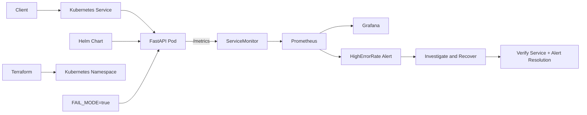

# SRE Reliability Lab

A fully local reliability lab for practicing how to deploy, observe, break, recover, and verify a service using Kubernetes, Helm, Prometheus/Grafana, Terraform, and GitHub Actions.

[](https://github.com/gabbyb-cloud/sre-reliability-lab/actions/workflows/validate.yml)


## Why it exists

I built this lab to practice the part of engineering that starts after an application is deployed: knowing whether it is healthy, detecting when behavior degrades, understanding what failed, recovering safely, and checking that the system actually returned to normal.

The application is intentionally small. The point of the project is the operational workflow around it, not application complexity.

## Architecture



The service runs in a local `kind` Kubernetes cluster. Helm manages the application resources, Prometheus scrapes application metrics through a `ServiceMonitor`, Grafana visualizes service behavior, and Terraform manages the existing lab namespace.

A controlled failure mode makes `/work` return HTTP 500 while readiness remains healthy, which allows the lab to exercise application-level failure detection without making the Pod unavailable.

## Key design decisions

- **The application stays simple on purpose.** FastAPI provides only the endpoints needed to practice health checks, workload behavior, and Prometheus metrics.
- **Readiness is kept healthy during failure injection.** This separates application errors from Kubernetes availability and lets Prometheus observe sustained 5xx behavior.
- **The reliability target is explicit.** The lab defines a 99% availability SLO for successful `/work` requests rather than relying on vague ideas of “healthy.”
- **Alerting is tied to measured behavior.** `HighErrorRate` fires when more than 20% of `/work` requests are 5xx over a 2-minute window for at least 1 minute.
- **Recovery includes verification.** Turning failure mode off is not considered enough; the rollout, endpoint behavior, Prometheus data, and alert state are checked afterward.
- **Operational work is documented.** The repository includes a runbook and a blameless postmortem so detection and recovery are treated as part of the system, not side notes.

## Quick start

Requirements: Docker, `kind`, `kubectl`, Helm, Terraform, and Git.

```bash
git clone https://github.com/gabbyb-cloud/sre-reliability-lab.git
cd sre-reliability-lab

docker build -t sre-reliability-lab:local .
kind create cluster --name sre-lab
kind load docker-image sre-reliability-lab:local --name sre-lab

helm install sre-reliability-lab \
  helm/sre-reliability-lab \
  --namespace sre-lab \
  --create-namespace
```

Verify the deployment:

```bash
kubectl get pods -n sre-lab
kubectl get services -n sre-lab
```

Install the monitoring stack:

```bash
helm repo add prometheus-community https://prometheus-community.github.io/helm-charts
helm repo update

helm install monitoring \
  prometheus-community/kube-prometheus-stack \
  --namespace monitoring \
  --create-namespace
```

## Testing and validation

GitHub Actions validates the repository on pushes and pull requests targeting `main`.

The workflow checks:

- Python source compilation
- Docker image build
- Helm chart linting
- Terraform formatting
- Terraform initialization and validation

The reliability exercise itself is tested by deliberately switching the service into failure mode:

```bash
kubectl set env deployment/sre-reliability-lab \
  -n sre-lab \
  FAIL_MODE=true
```

In failure mode:

```text
/ready -> HTTP 200
/work  -> HTTP 500
```

That lets Prometheus observe application failures while Kubernetes still considers the service ready.

Recover the service with:

```bash
kubectl set env deployment/sre-reliability-lab \
  -n sre-lab \
  FAIL_MODE=false

kubectl rollout status deployment/sre-reliability-lab \
  -n sre-lab \
  --timeout=120s
```

After recovery, the exercise verifies the rollout, endpoint behavior, error-rate metric, and alert resolution rather than assuming the change worked.

## Reliability and tradeoffs

**Application failure:** the lab can return controlled HTTP 500 responses from `/work` without failing readiness. This is useful for testing error-rate monitoring, but it is intentionally synthetic rather than a simulation of every real production failure mode.

**Health checks:** `/health` and `/ready` are separate endpoints so process health and readiness can be reasoned about independently. In a production service, readiness would likely include carefully chosen dependency checks rather than only local application state.

**SLO scope:** the 99% SLO measures successful `/work` responses. It is deliberately narrow and easy to explain. A production service would usually define additional latency, dependency, and user-journey objectives.

**Alert sensitivity:** the `HighErrorRate` rule uses a short 2-minute window with a 1-minute hold because this is a low-traffic local lab. Those values would need to be tuned against real traffic patterns before production use.

**Infrastructure:** Terraform manages the existing `sre-lab` namespace rather than provisioning the entire local cluster. This keeps the IaC exercise focused on adopting existing infrastructure into state without pretending the project has a full production platform layer.

**Monitoring stack:** `kube-prometheus-stack` gives the lab Prometheus, Grafana, Alertmanager, kube-state-metrics, and node-exporter with minimal setup. It is excellent for a local lab, but it is not meant to represent a complete production observability architecture.

**Cost and portability:** everything runs locally with free and open-source tooling. That keeps the lab repeatable and avoids cloud costs, but it also means the project does not demonstrate managed Kubernetes, cloud IAM, or production networking.

Operational documentation lives in:

```text
docs/
├── RUNBOOK.md
└── POSTMORTEM.md
```

## Verified outcomes

The completed exercise demonstrates the full alert and recovery lifecycle:

```text
Inactive -> Pending -> Firing -> Resolved
```

During the controlled incident, sustained HTTP 500 traffic caused `HighErrorRate` to reach the firing state. After `FAIL_MODE` was disabled and the Prometheus lookback window cleared, the alert returned to an inactive state.

The lab also adopted the existing `sre-lab` namespace into Terraform state and verified it with:

```text
No changes. Your infrastructure matches the configuration.
```

These are functional reliability checks rather than performance benchmarks. I have not included throughput or latency claims because this project was built to exercise operations, observability, and recovery rather than benchmark the FastAPI service.

## What I'd do next

- Add automated failure scenarios so the alert-and-recovery path can be exercised repeatedly instead of relying on manual `kubectl` steps.
- Add distributed tracing and a small dependency so the lab can practice diagnosing failures across service boundaries, not only inside one application.
- Move the same reliability workflow to a small cloud environment and add IAM, managed networking, and cloud-specific operational controls while keeping the local version available for $0 practice.

## Reference

The application exposes:

| Endpoint | Purpose |
| --- | --- |
| `GET /health` | Liveness check |
| `GET /ready` | Readiness check |
| `GET /work` | Workload endpoint used for reliability testing |
| `GET /metrics` | Prometheus metrics endpoint |

Prometheus metrics include:

- `sre_lab_requests_total`
- `sre_lab_request_duration_seconds`

The availability SLI is based on successful `/work` requests divided by total `/work` requests over the measurement window.
